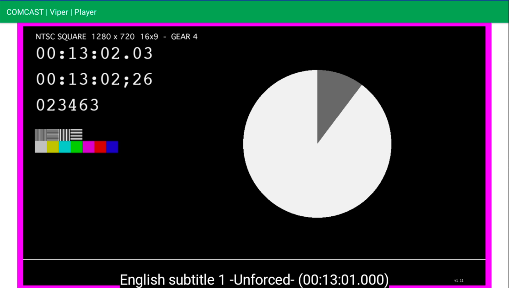

# Comcast Code Challenge
Create a minimal video player app that uses ExoPlayer. The app should launch into a full-screen player activity and begin playing the video below. No time needs to be spent on a UI or handling cases like orientation changes.
 
Add a basic analytics component that reports the following playback events:
- A single event when playback begins.
- An event sent every second that includes the current player position and information about the selected track(s).
- An event when the bitrate changes that includes information about the previous and new bitrate.
 
The component should be designed to support different implementations. The app must include one implementation that logs the events to logcat. Another possible implementation outside the scope of this task could send the events to an analytics service.
 
URL to play: https://devstreaming-cdn.apple.com/videos/streaming/examples/bipbop_16x9/bipbop_16x9_variant.m3u8
 
Bonus:
- Written in Kotlin
- Some level of unit tests for the analytics component
- There is a clear separation between the app, player, and analytics components.
has context menu
---
# Solution
---
## Application Layers

* Media player UI Components:

* Analytics handled by the "ViperReporter.kt" and the reporting integration can be switched between
   - **Local logging** 
   - **External analytical logging**

* Requirement specific events are filtered and reported through following tags,
  - PLAYER_BIT_RATE_CHANGE (Bitrate changes that includes information about the previous and new bitrate)
  - PLAYER_PLAYBACK (Event when playback begins)
  - PLAYER_TRACK_CHANGE (Information about the selected track(s))
  - PLAYER_TRACK_POSITION (Event sent every second that includes the current player position)
  - PLAYER_ANALYTICS (All other events)
  
* All other integration logics were kept inside the "PlayerViewModel.kt"

## Sample Event Reporting
* Playback position
* Playback status [Buffering/Begin]
* Selected Track details

## Screen shot

